<div align="center">

# Consigna Practica 1 - Creacion de ambiente de trabajo
# Consigna Practica 1
## Creacion de ambiente de trabajo

**Universidad Catolica del Uruguay - Facultad de Ingenieria**

<br>

**Asignatura:** Desarrollo de Software Seguro <br>
**Profesores:** Wiler Alvez / Alejandro Piccardo <br>
**Estudiante:** Martin Mujica <br>
**Fecha:** 05/09/2026

</div>

<br>

## Introduccion

El presente informe documenta el analisis y la mitigacion de diferentes vulnerabilidades del Practico 2.

Para cada ejercicio se busca identificar la vulnerabilidad, comprender su causa, demostrar su explotacion mediante una prueba de concepto (POC), e implementar una modificacion que elimine la vulnerabilidad.

Despues de implementar cada mitigacion, se vuelve a ejecutar la aplicacion para comprobar que la aplicacion continue operativa y que las entradas utilizadas durante la POC ya no produzcan el comportamiento vulnerable.

## Herramientas utilizadas

- **Git**
- **Visual Studio Code**
- **Docker**
- **Navegador web**


## Vulnerabilidades analizadas

1. **Ejercicio 1 - Inyeccion SQL (SQL Injection)**

2. **Ejercicio 2 - Cross-Site Scripting (XSS)**

3. **Ejercicio 3 - Carga de archivos sin restricciones**

4. **Ejercicio 4 - Server-Side Template Injection (SSTI)**

5. **Ejercicio 5 - Almacenamiento inseguro**

<br>
<br>

---
# Ejercicio 1 - Inyeccion SQL (SQL Injection)

## Marco teorico

Una inyeccion ocurre cuando una aplicacion recibe un dato del usuario y lo coloca directamente dentro de una instruccion. Esto puede provocar que el dato sea interpretado como parte del codigo y no solamente como informacion.

En una inyeccion SQL, el usuario consigue modificar una consulta enviada a la base de datos. Esto sucede normalmente cuando el programa construye el SQL concatenando o interpolando directamente los valores recibidos.

Las entradas vulnerables no provienen solamente de campos de texto. Tambien pueden llegar desde:

- Parametros de la URL.
- Selectores HTML.
- Formularios.
- Cookies.
- Cuerpos JSON.
- Encabezados HTTP.

Por este motivo, el servidor siempre debe validar y manejar de forma segura los datos recibidos, aunque la interfaz limite las opciones disponibles.

### Formas comunes de SQL injection

Algunas formas comunes de aprovechar una SQL injection son:

- Modificar una condicion para obtener mas resultados.
- Ignorar parte de la consulta original.
- Utilizar `UNION SELECT` para consultar otra informacion.
- Consultar las tablas internas de la base de datos.
- Modificar partes como `ORDER BY` o `LIMIT`.

### Elementos utilizados en una inyeccion

**La comilla simple:**

```sql
'
```

puede utilizarse para cerrar un texto dentro de la consulta.

El operador `OR` permite agregar otra condicion:

```sql
OR 1=1
```

La expresion `1=1` siempre es verdadera, por lo que puede conseguir que una consulta devuelva todos los registros.

**Los dos guiones:**

```sql
--
```

indican el comienzo de un comentario en SQL. Todo lo que aparece despues puede ser ignorado por el motor de base de datos.

**La instruccion:**

```sql
UNION SELECT
```

permite agregar un segundo `SELECT` a la consulta original. Para que funcione, ambos `SELECT` deben devolver la misma cantidad de columnas.

<br>

## Prueba de concepto (POC)

Pra las siguientes pruebas primero se comprobo el comportamiento vulnerable y posteriormente se repitieron las pruebas despues de implementar la mitigacion.

### POC 1 - Alteracion de la condicion con `OR 1=1`

Para comprobar la vulnerabilidad del campo de busqueda, se ingreso el siguiente valor:

```text
' OR 1=1 --
```

La comilla simple cierra el texto utilizado por el `LIKE`, mientras que `OR 1=1` incorpora una condicion que siempre es verdadera. Finalmente, `--` comenta el resto de la consulta original.

Como `1=1` siempre es verdadero, la aplicacion devuelve todas las funciones disponibles, aunque el texto ingresado no corresponda al nombre de una pelicula.

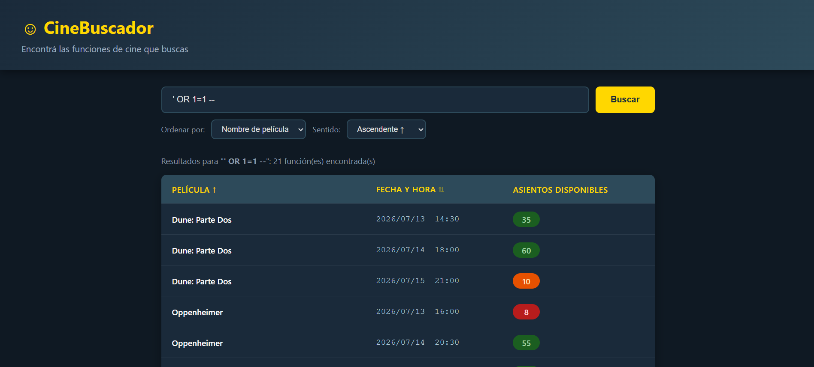

### POC 2 - Consulta de informacion mediante `UNION SELECT`

Para realizar esta prueba se utilizo primero un nombre de pelicula inexistente. De esta forma, la consulta original no devuelve resultados y en la interfaz se muestra que no se encontraron peliculas.

Luego se agrego una consulta mediante `UNION SELECT` para obtener informacion adicional de la base de datos.

**Entrada utilizada:**

```text
NoHayPeliculas' UNION SELECT name, '2026-09-01', 0 FROM sqlite_master WHERE type='table' --
```

La consulta inyectada debe devolver tres columnas, ya que el `SELECT` original tambien devuelve tres:

1. Nombre de la pelicula.
2. Fecha y hora.
3. Cantidad de asientos disponibles.

La utilizacion de `UNION SELECT` permite combinar el resultado original con informacion proveniente de otra tabla. En SQLite puede consultarse `sqlite_master` para obtener los nombres o las definiciones de las tablas existentes.

**Informacion obtenida:**

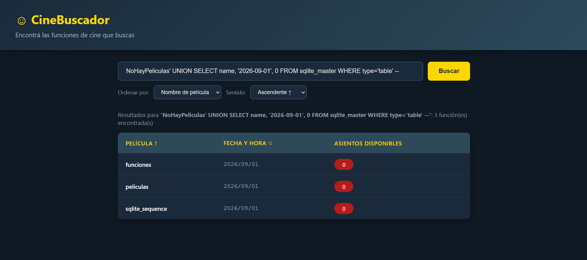

### POC 3 - Modificacion del ordenamiento mediante la URL

Como base para esta prueba, se realizo una busqueda normal utilizando la letra:

```text
s
```

La aplicacion devolvio las peliculas cuyos nombres contienen la letra indicada. Esto permite registrar el comportamiento legitimo antes de implementar la mitigacion y compararlo posteriormente.


Luego se trato de modificar la URL de la aplicacion mediante el parametro `sentido` de la URL.

Una solicitud normal utiliza una URL similar a:

```text
http://localhost:5000/?buscar=s&ordenar_por=nombre&sentido=ASC
```

En la version vulnerable, el valor de `sentido` se agregaba directamente al final de la consulta SQL. Por este motivo, se modifico manualmente la URL para incorporar un `LIMIT`:

```text
http://localhost:5000/?buscar=s&ordenar_por=nombre&sentido=ASC%20LIMIT%201
```

El codigo `%20` representa un espacio dentro de la URL. Flask interpreta el valor recibido como:

```text
ASC LIMIT 1
```

La consulta resultante termina con:

```sql
ORDER BY peliculas.nombre ASC LIMIT 1;
```

Como resultado, la aplicacion muestra unicamente un registro, aunque la busqueda normal con la letra `s` devolvia varios resultados.

Esta prueba demuestra que una SQL injection no tiene que provenir de un campo de texto. Tambien puede introducirse modificando los parametros de una URL.

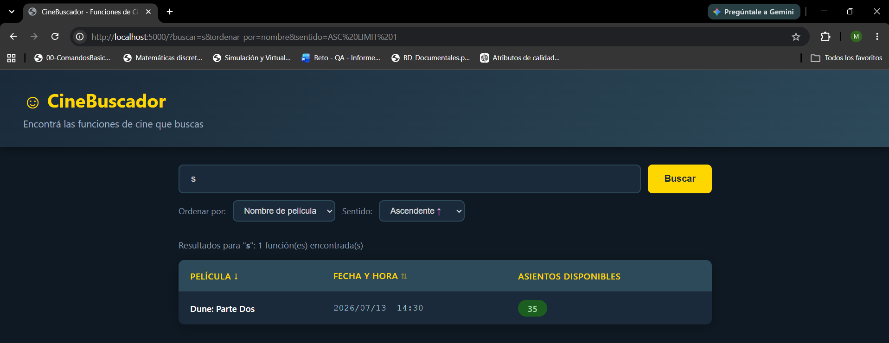


## Mitigacion

Para mitigar la vulnerabilidad se modifico la funcion `buscar_funciones()` aplicando dos medidas:

1. Parametrizacion del termino de busqueda.
2. Validacion de los valores utilizados para ordenar los resultados.

El codigo corregido quedo de la siguiente manera:

```python
def buscar_funciones(query, sort_by, sort_dir='ASC'):

    if sort_by == 'fecha':
        sort_by = 'funciones.fecha_hora'
    else:
        sort_by = 'peliculas.nombre'

    sort_dir=sort_dir.upper()
    if sort_dir not in ('ASC', 'DESC'):
        sort_dir = 'ASC'

    db = get_db()
    sql = f"SELECT peliculas.nombre as pelicula, funciones.fecha_hora, " \
          f"(funciones.asientos_totales - funciones.asientos_ocupados) as disponibles " \
          f"FROM funciones " \
          f"JOIN peliculas ON funciones.pelicula_id = peliculas.id " \
          f"WHERE peliculas.nombre LIKE ? " \
          f"ORDER BY {sort_by} {sort_dir}"
    return db.execute(sql, (f"%{query}%",)).fetchall()
```

### Parametrizacion de la busqueda

En la versiona con la vulnerabilidad el valor ingresado por el usuario se colocaba directamente dentro del SQL:

```python
f"WHERE peliculas.nombre LIKE '%{query}%' "
```

Esto permitia que una entrada con instrucciones SQL modificara la consulta.

Se reemplazo por un parametro:

```python
"WHERE peliculas.nombre LIKE ? "
```

El valor se envia separadamente al ejecutar la consulta:

```python
db.execute(
    sql,
    (f"%{query}%",)
)
```

De esta manera, SQLite interpreta todo el contenido de `query` como un dato y no como parte de la consulta SQL.

Los simbolos `%` se agregan al parametro para mantener la busqueda parcial realizada mediante `LIKE`.

### Validacion de la columna de ordenamiento

Los nombres de columnas no pueden parametrizarse utilizando `?`. Por este motivo, el valor recibido mediante `sort_by` se transforma en una columna definida por la aplicacion:

```python
if sort_by == 'fecha':
    sort_column = 'funciones.fecha_hora'
else:
    sort_column = 'peliculas.nombre'
```

Los unicos valores que pueden llegar al `ORDER BY` son:

```sql
funciones.fecha_hora
```

o

```sql
peliculas.nombre
```

Si se recibe cualquier otro valor, se utiliza `peliculas.nombre` como opcion predeterminada.

### Validacion del sentido de ordenamiento

El parametro `sort_dir` se obtiene desde la URL y, en la version vulnerable, se agregaba directamente al final de la consulta.

Primero se transforma el valor a mayusculas:

```python
sort_dir = sort_dir.upper()
```

Luego se verifica que sea uno de los dos sentidos permitidos:

```python
if sort_dir not in ('ASC', 'DESC'):
    sort_dir = 'ASC'
```

Esto evita que se agreguen nuevas instrucciones mediante el parametro `sentido` de la URL.

## Verificacion de la mitigacion

Despues de modificar el codigo, se repitieron las pruebas realizadas sobre la version vulnerable. El objetivo fue comprobar que la SQL injection ya no pudiera reproducirse y que las busquedas legitimas continuaran funcionando.

### Comprobacion 1 - Bloqueo de la inyeccion en el buscador

Se volvio a ingresar el valor utilizado anteriormente para modificar la condicion de la consulta:

```sql
' OR 1=1 --
```

En la version vulnerable, esta entrada provocaba que la condicion fuera siempre verdadera y mostraba todas las funciones.

Despues de la mitigacion, el valor es enviado separadamente mediante el parametro `?`:

```python
"WHERE peliculas.nombre LIKE ?"
```

```python
db.execute(sql, (f"%{query}%",))
```

SQLite interpreta la entrada completa como un texto que debe buscarse en el nombre de una pelicula. Por lo tanto, `OR 1=1` y `--` dejan de interpretarse como instrucciones SQL.

Como no existe una pelicula con ese contenido en su nombre, la aplicacion no devuelve resultados.

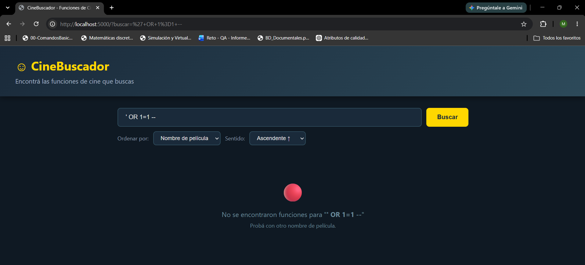
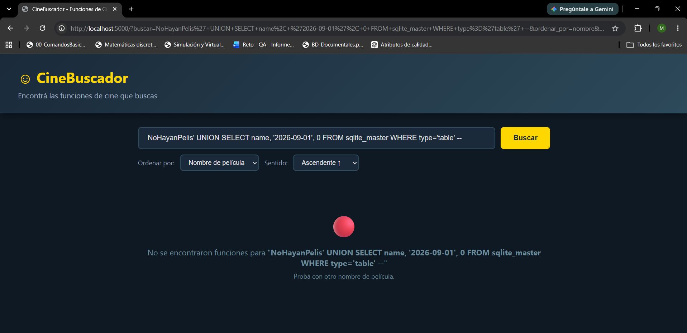

### Comprobacion 2 - Bloqueo de la modificacion mediante la URL

Finalmente, se volvio a modificar el parametro `sentido` para intentar agregar un `LIMIT 1`:

```text
http://localhost:5000/?buscar=s&ordenar_por=nombre&sentido=ASC%20LIMIT%201
```

El servidor recibe el siguiente valor:

```text
ASC LIMIT 1
```

Sin embargo, este valor no se encuentra dentro de los sentidos permitidos:

```python
if sort_dir not in ('ASC', 'DESC'):
    sort_dir = 'ASC'
```

Por este motivo, la aplicacion reemplaza el contenido recibido por:

```text
ASC
```

La consulta se ejecuta sin el `LIMIT 1` agregado desde la URL y muestra nuevamente todos los resultados correspondientes a la busqueda.

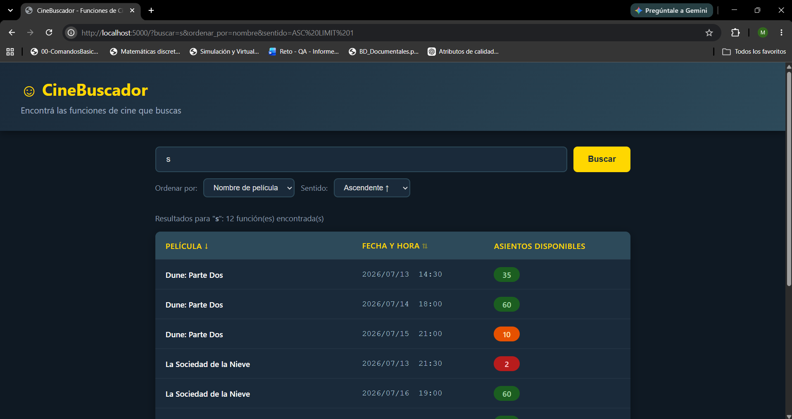

---

# Ejercicio 2 - Cross-Site Scripting (XSS)

## Marco teorico

Una vulnerabilidad Cross-Site Scripting, tambien conocida como XSS, ocurre cuando una aplicacion muestra un dato ingresado por el usuario y el navegador lo interpreta como HTML o JavaScript.

Esto puede permitir que una persona introduzca codigo que se ejecutara cuando otro usuario visite la pagina vulnerable.

Las entradas utilizadas en un XSS pueden provenir de:
- Campos de texto.
- Formularios.
- Parametros de la URL.
- Datos almacenados en una base de datos.
- Cuerpos JSON.
- Cookies.

Existen diferentes tipos de XSS:

- **XSS reflejado:** el contenido llega en una solicitud y se muestra inmediatamente.
- **XSS almacenado:** el contenido se guarda y se ejecuta posteriormente cuando se vuelve a mostrar.
- **XSS basado en DOM:** el JavaScript del frontend introduce el contenido inseguro dentro de la pagina.

## Prueba de concepto (PoC)

Para comprobar la vulnerabilidad se modifico la descripcion de una pelicula desde la pagina de edicion.

### POC 1 - Ingreso del codigo en la descripcion

Primero se ingreso el siguiente contenido en el campo `Descripcion`:

```html
<script>alert('XSS')</script>
```

Luego se presiono el boton `Guardar cambios`.

El contenido fue recibido por Flask y almacenado en la columna `descripcion` de la tabla `peliculas`.

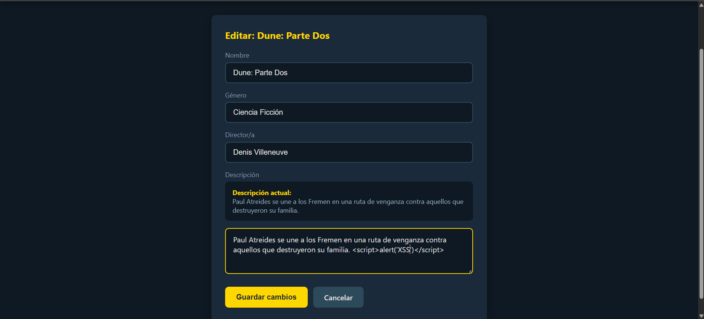

Despues de guardar los cambios, se volvio a abrir la pagina de edicion de la misma pelicula.

Como consecuencia de lo realizado anteriormente, el navegador interpreto la etiqueta `script` y ejecuto:

```javascript
alert('XSS')
```

La aparicion de la alerta demuestra que fue posible ejecutar JavaScript introducido por el usuario.

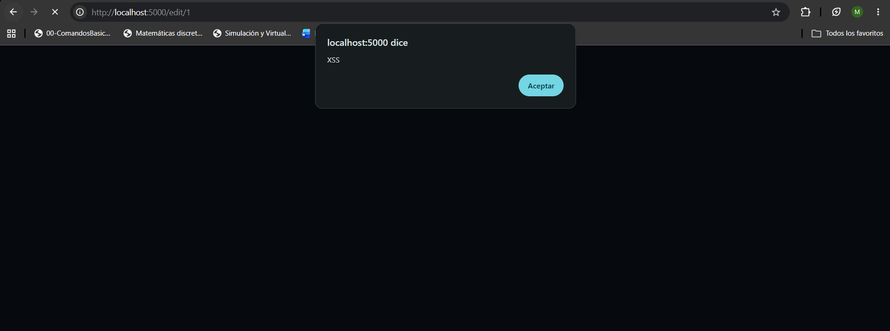

La entrada continua almacenada en la base de datos despues de guardar los cambios.

Por este motivo, cada vez que se vuelve a abrir la edicion de la pelicula, el navegador vuelve a procesar el contenido guardado.

Esto permite clasificar la vulnerabilidad como un XSS almacenado.

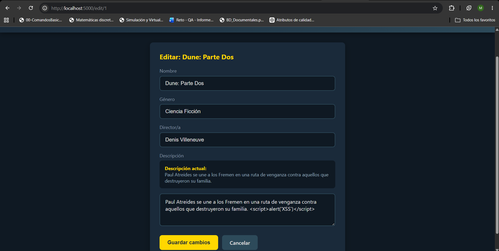


## Mitigacion

Para mitigar la vulnerabilidad se elimino el filtro `safe` utilizado al mostrar la descripcion.

El codigo vulnerable era:

```html
{{ pelicula['descripcion'] | safe }}
```

Se reemplazo por:

```html
{{ pelicula['descripcion'] }}
```

La seccion corregida de `edit.html` quedo de la siguiente manera:

```html

    <div class="prev-descripcion">
        <strong>Descripcion actual:</strong><br>
            {{ pelicula['descripcion'] | safe }}
    </div>

```

## Verificacion de la mitigacion

Despues de eliminar el filtro `safe`, se repitieron las pruebas realizadas.

### Comprobacion - Bloqueo de la ejecucion de JavaScript

Se volvio a guardar el siguiente contenido en la descripcion:

```html
<script>alert('XSS')</script>
```

Despues se abrio nuevamente la edicion de la pelicula.


El contenido ingresado se mostro literalmente en la pagina:

```text
<script>alert('XSS')</script>
```

El navegador dejo de interpretarlo como codigo HTML o JavaScript.

<br>

---

# Ejercicio 3 - Carga de archivos sin restricciones

## Marco teorico

Una vulnerabilidad de carga de archivos ocurre cuando una aplicacion permite subir archivos sin comprobar correctamente su tipo, extension o nombre.

Esto puede permitir que un usuario almacene archivos que la aplicacion no esperaba, como archivos de texto, HTML, scripts u otros tipos de archivos peligrosos.

En este ejercicio se encontraron dos problemas:

1. La aplicacion permite subir cualquier tipo de archivo.
2. El archivo se guarda utilizando su nombre original, haciendo que su ubicacion sea facil de predecir.


---

## Prueba de concepto (POC)


### POC 1 - Subida de cualquier archivo

El formulario permite seleccionar cualquier tipo de archivo. El principal problema se encuentra en el servidor, ya que el archivo se guarda sin validar su extension.

El servidor obtiene el nombre original y guarda directamente el archivo. No se comprueba si el archivo es realmente un afiche o si tiene una extension permitida.

---

Para comprobar la primera vulnerabilidad se selecciono un archivo de texto llamado `repo.txt`.

Aunque el formulario esta pensado para subir afiches, la aplicacion permite seleccionar el archivo sin mostrar ninguna restriccion.

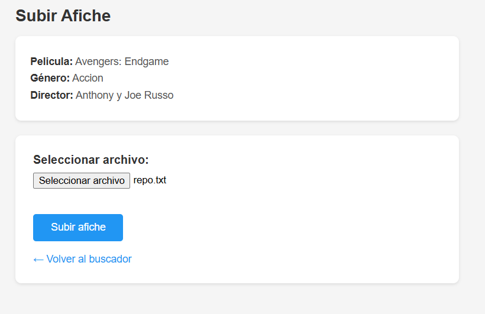

Luego de presionar el boton de subida, la aplicacion acepta y almacena el archivo.

Como el archivo no es una imagen, el navegador no puede mostrarlo correctamente como afiche.

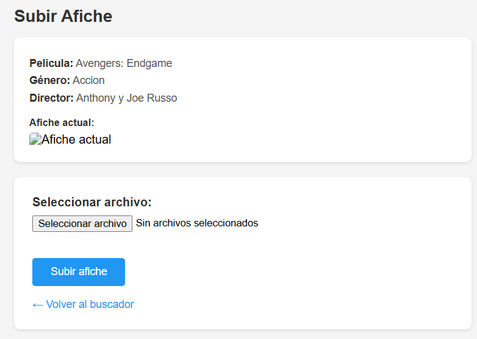

Esto demuestra que la validacion no se realizaba en el servidor y que era posible almacenar archivos con extensiones diferentes a las esperadas.

### POC 2 - Acceso utilizando el nombre original

### Uso del nombre original

El archivo tambien se almacena utilizando exactamente el nombre proporcionado durante la subida.

Como el archivo se almacena utilizando el nombre original, se conoce de antemano la ruta en la que se encuentra.

Se ingreso manualmente la siguiente direccion:

```text
http://localhost:8080/uploads/repo.txt
```

La aplicacion devolvio el contenido del archivo subido.

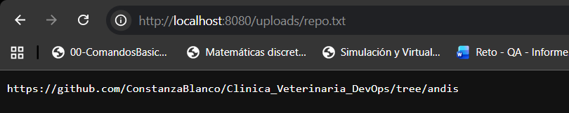

Tambien se comprobo desde el contenedor que el archivo fue almacenado dentro del directorio `uploads` con el nombre original `repo.txt`.

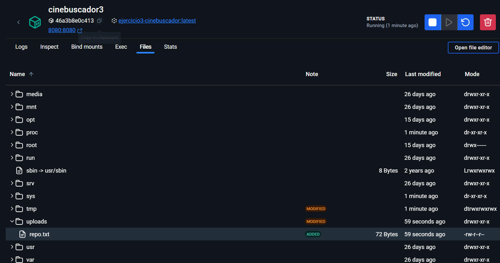

Por lo tanto, cualquier persona que conozca o pueda adivinar el nombre del archivo puede intentar acceder a el mediante la ruta publica de archivos.

---

## Mitigacion

Para corregir las vulnerabilidades se realizaron dos cambios principales:

1. Validar la extension del archivo antes de almacenarlo.
2. Reemplazar el nombre original por un UUID aleatorio.

### Validacion de la extension

Primero se obtiene el nombre original del archivo:

```java
String nombreOriginal = archivo.getOriginalFilename();
```

Se comprueba que el nombre exista y que tenga una extension:

```java
if (nombreOriginal == null || !nombreOriginal.contains(".")) {
    return "redirect:/upload/" + id;
}
```

Luego se obtiene la extension:

```java
int i = nombreOriginal.lastIndexOf('.');

String extension = nombreOriginal
    .substring(i + 1)
    .toLowerCase();
```

Finalmente, se permite solamente la subida de archivos con extension `png`, `jpg` o `jpeg`:

```java
if (!List.of("png", "jpg", "jpeg").contains(extension)) {
    return "redirect:/upload/" + id;
}
```

Si el archivo no tiene una extension permitida, la aplicacion vuelve al formulario y no almacena el archivo.

### Generacion de un nombre aleatorio

Para evitar utilizar el nombre original se genera un UUID:

```java
String uuidAleatorio = UUID.randomUUID().toString();
String filename = uuidAleatorio + "." + extension;
```

Por ejemplo, un archivo llamado:

```text
capa8.jpg
```

puede almacenarse con un nombre similar al siguiente:

```text
62b207d8-67f6-46d6-9eb5-6aa592a0a8b7.jpg
```

De esta forma, el usuario no controla el nombre final utilizado por el servidor y la direccion del archivo deja de ser facilmente predecible.

### Codigo corregido

El metodo de subida queda de la siguiente manera:

```java
@PostMapping("/upload/{id}")
public String uploadFile(
        @PathVariable Integer id,
        @RequestParam("afiche") MultipartFile archivo
) throws IOException {

    Pelicula pelicula = peliculaRepo.findById(id)
        .orElseThrow(() ->
            new EntityNotFoundException("Pelicula no encontrada")
        );

    String nombreOriginal = archivo.getOriginalFilename();

    if (nombreOriginal == null || !nombreOriginal.contains(".")) {
        return "redirect:/upload/" + id;
    }

    int i = nombreOriginal.lastIndexOf('.');

    String extension = nombreOriginal
        .substring(i + 1)
        .toLowerCase();

    if (!List.of("png", "jpg", "jpeg").contains(extension)) {
        return "redirect:/upload/" + id;
    }

    String uuidAleatorio = UUID.randomUUID().toString();
    String filename = uuidAleatorio + "." + extension;

    Path uploadPath = Paths.get(uploadDir);

    if (!Files.exists(uploadPath)) {
        Files.createDirectories(uploadPath);
    }

    Files.copy(
        archivo.getInputStream(),
        uploadPath.resolve(filename)
    );

    pelicula.setAfichePath(filename);
    peliculaRepo.save(pelicula);

    return "redirect:/";
}
```

Tambien es necesario importar `UUID`:

```java
import java.util.UUID;
```

---

## Verificacion de la mitigacion

### Comprobacion de un archivo no permitido

Para verificar la validacion se intento subir nuevamente el archivo `repo.txt`.

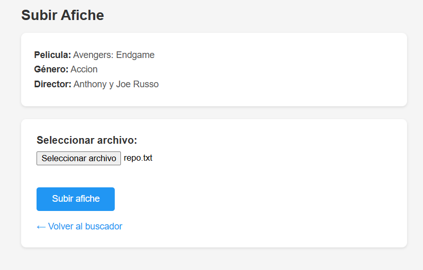

Al presionar el boton, la aplicacion rechazo el archivo y regreso al formulario de subida.

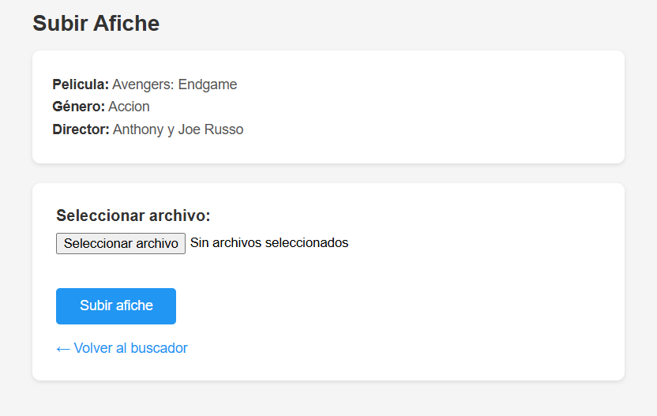

El archivo no fue almacenado porque la extension `txt` no se encuentra dentro de las extensiones permitidas.

### Comprobacion de una imagen permitida

Luego se selecciono una imagen valida llamada `capa8.jpg`.

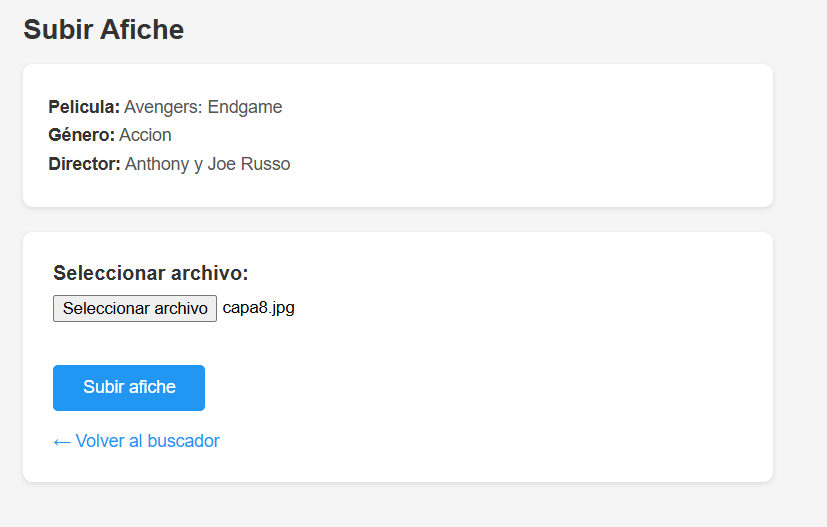

La aplicacion acepto el archivo y el afiche se mostro correctamente en el buscador.

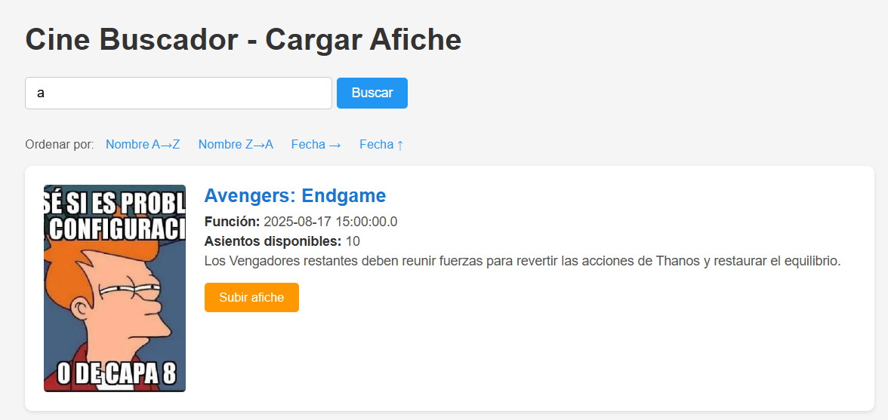

Esto comprueba que las extensiones permitidas pueden continuar siendo utilizadas normalmente.

### Comprobacion del cambio de nombre

Despues de subir la imagen se intento acceder utilizando su nombre original:

```text
http://localhost:8080/uploads/capa8.jpg
```

El servidor respondio con un error `404`, ya que el archivo no fue almacenado con ese nombre.

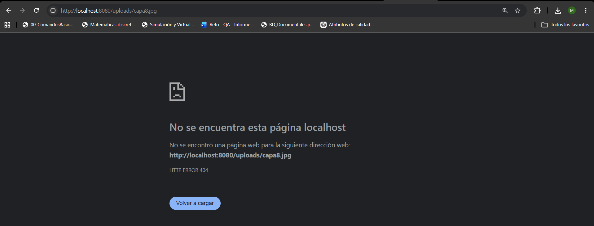

Finalmente, se reviso el directorio `uploads` dentro del contenedor.

La imagen fue almacenada utilizando un UUID en lugar del nombre original.

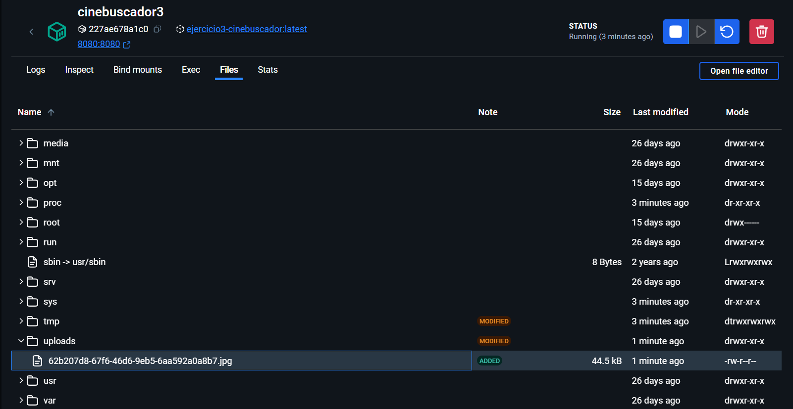

---


# Ejercicio 4 - Server Side Template Injection

## Marco teorico

La vulnerabilidad de **Server Side Template Injection** ocurre cuando una aplicacion recibe datos del usuario y el servidor los interpreta como instrucciones o expresiones en lugar de tratarlos como texto normal.

Los motores de lenguajes permiten utilizar operaciones dentro de determinados documentos o configuraciones. El problema aparece cuando una entrada controlada por el usuario se envia directamente a uno de estos motores.

Por ejemplo, una aplicacion puede recibir el siguiente texto:

```text
4*2
```

El comportamiento esperado para un buscador seria intentar encontrar literalmente el texto `4*2`. Sin embargo, una aplicacion vulnerable puede interpretar la entrada como una operacion y producir:

```text
8
```

Dependiendo de las capacidades disponibles en el contexto, un atacante podria utilizar esta vulnerabilidad para:

- Acceder a informacion interna.
- Consultar propiedades del servidor.
- Invocar metodos no esperados.
- Modificar el funcionamiento de la aplicacion.
- Provocar errores internos.
- En casos graves, ejecutar codigo o comandos.

## Prueba de concepto (POC)

Primero se ingreso el siguiente texto en el buscador:

```text
cap
```

En lugar de buscar funciones cuyo nombre contuviera el texto `cap`, la aplicacion devolvio un error interno del servidor:

```text
Internal Server Error - 500
```

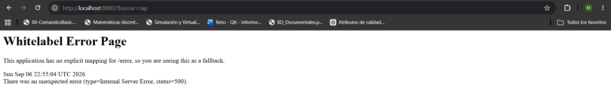

El error ocurre porque el contenido de `buscar` se envia al metodo `evaluate()`:

```java
String spelResultado = spelEval.evaluate(buscar);
```

Dentro de este metodo, spel intenta interpretar `cap` como una propiedad o expresion:

```java
var expr = parser.parseExpression(expression);
Objectärten result = expr.getValue(standardContext);
```

Como no existe una propiedad llamada `cap` dentro del contexto, la evaluacion falla y la aplicacion devuelve el error `500`.
Para confirmar que la entrada estaba siendo interpretada por spel, se ingreso:

```text
4*2
```

La aplicacion interpreto la expresion y mostro:

```text
Resultados buscando por: 8
```

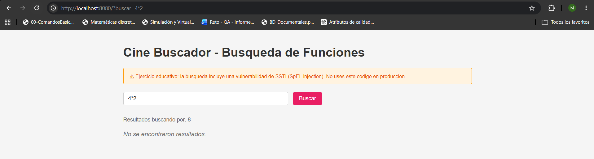

Este resultado confirma que el error anterior se produce porque el servidor intenta evaluar las busquedas como expresiones spel en lugar de tratarlas como texto normal.

## Mitigacion

La vulnerabilidad se produce porque el parametro `buscar` se envia a `SpelEvaluator`:

```java
String spelResultado = spelEval.evaluate(buscar);
```

Sin embargo, la funcionalidad solamente necesita comparar el texto ingresado con los nombres de las funciones. No existe ninguna necesidad de interpretar expresiones spel.

Por este motivo, se elimino el uso de `SpelEvaluator` y se comenzo a utilizar directamente el contenido de `buscar`.

### Eliminacion de SpelEvaluator

Se eliminaron del controlador la importacion, el atributo y la dependencia de `SpelEvaluator`.

### Controlador corregido

El metodo de busqueda utiliza ahora el parametro `buscar` directamente como texto:

```java
@GetMapping("/")
public String search(
        @RequestParam(required = false) String buscar,
        Model model
) {
    String textoBusqueda = buscar != null
        ? buscar.trim()
        : "";

    model.addAttribute("query", textoBusqueda);

    if (textoBusqueda.isBlank()) {
        List<Funcion> todas = funcionRepo.findAll();

        model.addAttribute("resultados", todas);
        model.addAttribute(
            "mensaje",
            "Mostrando todas las funciones."
        );

        return "index";
    }

    List<Funcion> resultados = funcionRepo.findAll().stream()
        .filter(f ->
            f.getNombreFuncion() != null &&
            f.getNombreFuncion()
                .toLowerCase()
                .contains(textoBusqueda.toLowerCase())
        )
        .collect(Collectors.toList());

    model.addAttribute("resultados", resultados);

    if (resultados.isEmpty()) {
        model.addAttribute(
            "mensaje",
            "No se encontraron coincidencias."
        );
    } else {
        model.addAttribute(
            "mensaje",
            "Resultados buscando por: " + textoBusqueda
        );
    }

    return "index";
}
```

Si la clase `SpelEvaluator` no es utilizada en otra parte de la aplicacion, tambien puede eliminarse completamente.

Con esta modificacion, la entrada permanece como un `String` y nunca se envia a un interprete de expresiones.

---

## Verificacion de la mitigacion

### Comprobacion de una expresion matematica

Luego de aplicar la correccion se ingreso:

```text
4+2
```

La aplicacion ya no calculo la suma ni transformo la entrada en `6`.

En cambio, busco literalmente el texto:

```text
4+2
```

Como no existe ninguna funcion con ese nombre, la aplicacion mostro el mensaje:

```text
No se encontraron coincidencias.
```

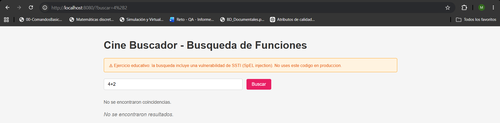

Esto demuestra que la entrada ya no es evaluada por SpEL.

### Comprobacion de una busqueda normal

Finalmente, se ingreso el texto:

```text
aveng
```

La aplicacion utilizo el contenido directamente para buscar coincidencias y mostro las funciones correspondientes a `Avengers`.

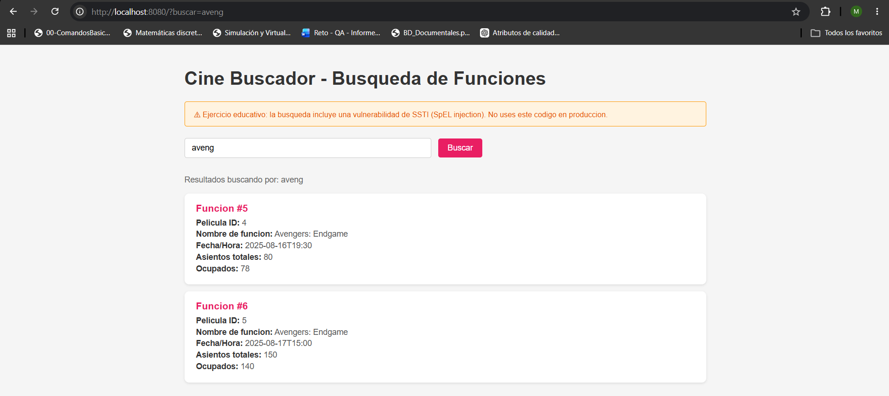


# Ejercicio 5 - Almacenamiento inseguro

## Prueba de concepto (POC)

La vulnerabilidad de este ejercicio se encuentra en la forma en que la aplicacion almacena las contraseñas de los usuarios.

En la version vulnerable, las contraseñas son cifradas utilizando `AES-256` en modo `ECB`:

```java
private static final String CIPHER_ALGO = "AES/ECB/PKCS5Padding";
```

Ademas, la clave utilizada para realizar el cifrado se encuentra directamente dentro del codigo fuente:

```java
rivate static final String SECRET_KEY = "MySup3rS3cr3tK3y!2024CineBuscadorAES";
```

El principal problema es que AES es un algoritmo de cifrado reversible. Por lo tanto, si se obtiene el valor cifrado y la clave utilizada por la aplicacion, es posible recuperar la contraseña original.

Adicionalmente, el modo `ECB` utilizado por la aplicacion es predecible: al cifrar dos veces exactamente la misma contraseña con la misma clave se obtiene el mismo resultado.

Para demostrar estos problemas se realizaron las siguientes pruebas.

### POC 1 - Comparacion de dos usuarios con la misma contraseña

Primero se creo un usuario:

```text
Usuario: mmujica
Contraseña: [mmujica]
```

Luego se inicio sesion con el usuario.

Despues de realizar correctamente el inicio de sesion, la aplicacion muestra el valor cifrado correspondiente a la contraseña:

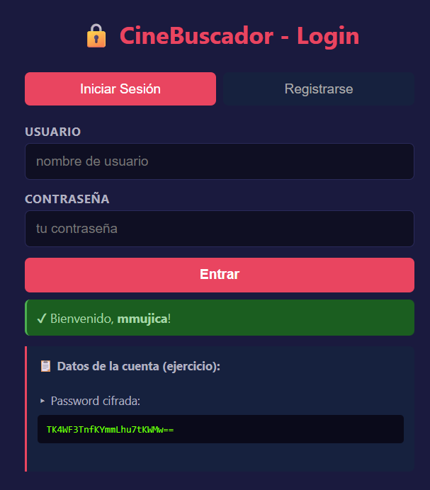

Posteriormente se creo un segundo usuario diferente:

```text
Usuario: mmujica2
Contraseña: [mmujica]
```

Se utilizo exactamente la misma contraseña que para el primer usuario.

Despues de iniciar sesion con `mmujica2`, la aplicacion mostro nuevamente la contraseña cifrada.


Al comparar ambos resultados se puede observar que los dos usuarios poseen exactamente el mismo valor cifrado:

Esto ocurre porque la aplicacion utiliza:

```java
AES/ECB/PKCS5Padding
```

y siempre utiliza la misma clave para realizar el cifrado, por este motivo, una misma entrada produce el mismo ciphertext.

Esto permite identificar patrones entre las contraseñas almacenadas. Por ejemplo, aunque inicialmente no se conozca cual es la contraseña utilizada, puede determinarse que dos usuarios están utilizando exactamente la misma.

### POC 2 - Clave AES embebida en el codigo fuente

Se reviso la clase encargada del cifrado de las contraseñas.

Dentro de `EncryptionService` se encontró la siguiente constante:

```java
private static final String SECRET_KEY = "MySup3rS3cr3tK3y!2024CineBuscadorAES";
```

La clave utilizada para proteger todas las contraseñas se encuentra escrita directamente dentro del codigo fuente de la aplicacion.

La misma clave es utilizada para crear el objeto:

```java
secretKey = new SecretKeySpec(
    Arrays.copyOf(keyBytes, 32),
    "AES"
);
```

y posteriormente para realizar el cifrado:

```java
Cipher cipher = Cipher.getInstance(CIPHER_ALGO);
cipher.init(Cipher.ENCRYPT_MODE, secretKey);
```

Por lo tanto, una persona que tenga acceso al codigo fuente de la aplicacion puede conocer tanto el algoritmo utilizado como la clave necesaria para realizar la operacion inversa.

## Mitigacion

Para mitigar la vulnerabilidad se elimino el cifrado reversible de las contraseñas mediante AES y se reemplazo por el uso de `BCryptPasswordEncoder`.

El principal problema de la version vulnerable era que las contraseñas se almacenaban utilizando AES. Al tratarse de un algoritmo de cifrado reversible, una persona que consiguiera el valor cifrado y la clave utilizada por la aplicacion podia recuperar la contraseña original.

Ademas, la clave utilizada para realizar el cifrado se encontraba escrita directamente dentro del codigo fuente:

```java
private static final String SECRET_KEY = "MySup3rS3cr3tK3y!2024CineBuscadorAES";
```

Por este motivo, se elimino completamente el uso de AES para el almacenamiento de contraseñas y se comenzo a utilizar BCrypt.

### Uso de BCrypt

En `EncryptionService` se creo una instancia de `BCryptPasswordEncoder`:

```java
private static final BCryptPasswordEncoder passwordEncoder = new BCryptPasswordEncoder();
```

A diferencia del cifrado AES utilizado anteriormente, BCrypt genera un hash que no necesita ser descifrado para realizar el inicio de sesion.

Para almacenar una contraseña se utiliza:

```java
public static String hashPassword(String password) {
    return passwordEncoder.encode(password);
}
```

De esta manera, la contraseña ingresada por el usuario se transforma en un hash antes de ser almacenada.

La clase `EncryptionService` corregida queda de la siguiente manera:

```java
package com.cinebuscador.config;

import javax.crypto.Cipher;
import javax.crypto.spec.SecretKeySpec;
import java.nio.charset.StandardCharsets;
import java.util.Arrays;
import java.util.Base64;

import org.springframework.security.crypto.bcrypt.BCryptPasswordEncoder;

public class EncryptionService {

    private static final BCryptPasswordEncoder passwordEncoder = new BCryptPasswordEncoder();

    private EncryptionService() {
    }

    public static String hashPassword(String password) {
        return passwordEncoder.encode(password);
    }

    public static boolean verifyPassword(String password, String hashedPassword) {
        return passwordEncoder.matches(password, hashedPassword);
    }
}
```

Con esta modificacion ya no existe una clave AES dentro del codigo y tampoco existen metodos para cifrar o descifrar contraseñas.

---

### Modificacion del registro de usuarios

En la version vulnerable, la contraseña era cifrada antes de almacenarse utilizando AES.

Luego de la mitigacion, al registrar un nuevo usuario se genera un hash utilizando BCrypt:

```java
com.cinebuscador.model.User nuevoUsuario = new com.cinebuscador.model.User();
nuevoUsuario.setUsername(username);
nuevoUsuario.setPassword(EncryptionService.hashPassword(password));
userRepository.save(nuevoUsuario);
```

Por lo tanto, el valor almacenado en la base de datos ya no corresponde a una contraseña cifrada que pueda ser recuperada posteriormente.

---

### Modificacion del inicio de sesion

Como la contraseña ya no puede ni necesita ser descifrada, tambien se modifico el proceso de inicio de sesion.

Primero se obtiene el hash almacenado correspondiente al usuario:

```java
String userHashedPassword = user.getPassword();
```

Luego se utiliza el metodo `verifyPassword()`:

```java
String userHashedPassword = user.getPassword();

if (EncryptionService.verifyPassword(password, userHashedPassword)) {
    model.addAttribute("loginSuccess", true);
    model.addAttribute("welcomeUser", username);
    return "index";
}
```

Internamente, este metodo utiliza:

```java
passwordEncoder.matches(password, hashedPassword);
```

BCrypt toma la contraseña ingresada durante el login y comprueba si corresponde con el hash almacenado.

No es necesario recuperar la contraseña original en ningun momento.

---

De esta manera, la aplicacion deja de almacenar contraseñas utilizando un mecanismo reversible y tampoco mantiene una clave criptografica estatica dentro del codigo fuente.

Ademas, BCrypt incorpora un valor aleatorio en la generacion de cada hash. Por este motivo, dos usuarios que utilicen exactamente la misma contraseña pueden tener hashes diferentes.